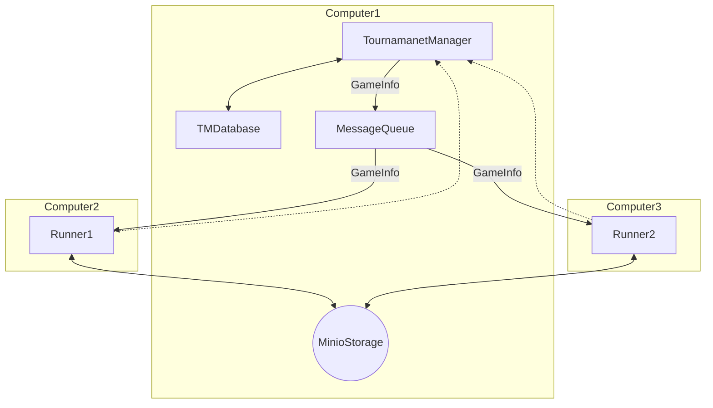
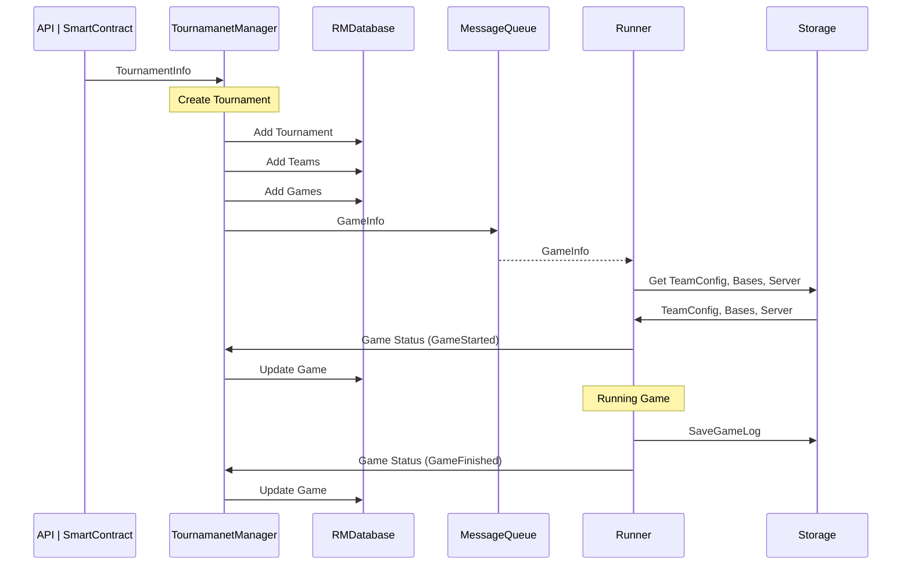
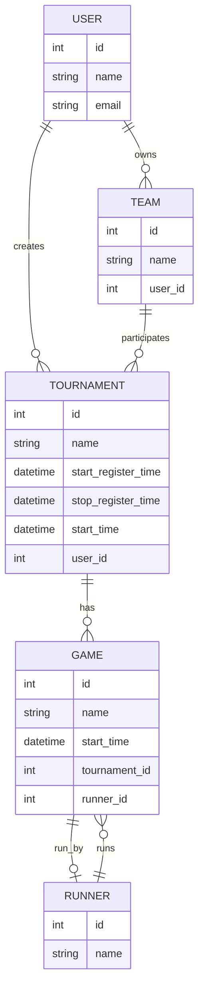

# Foxsy Tournament Manager

## Introduction

Foxsy Tournament Manager is a system that can manage the tournament of Soccer Simulation Game.

## Workflow

## Entity Relations

## Run Development

go to tournoment manager and run
uv sync

go to runner folder and run 
uv sync
