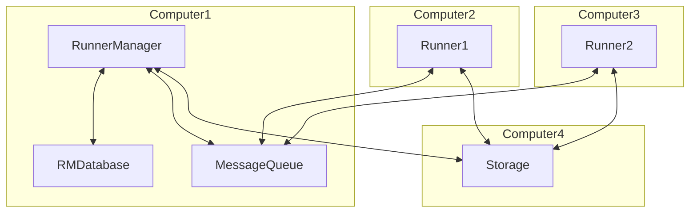
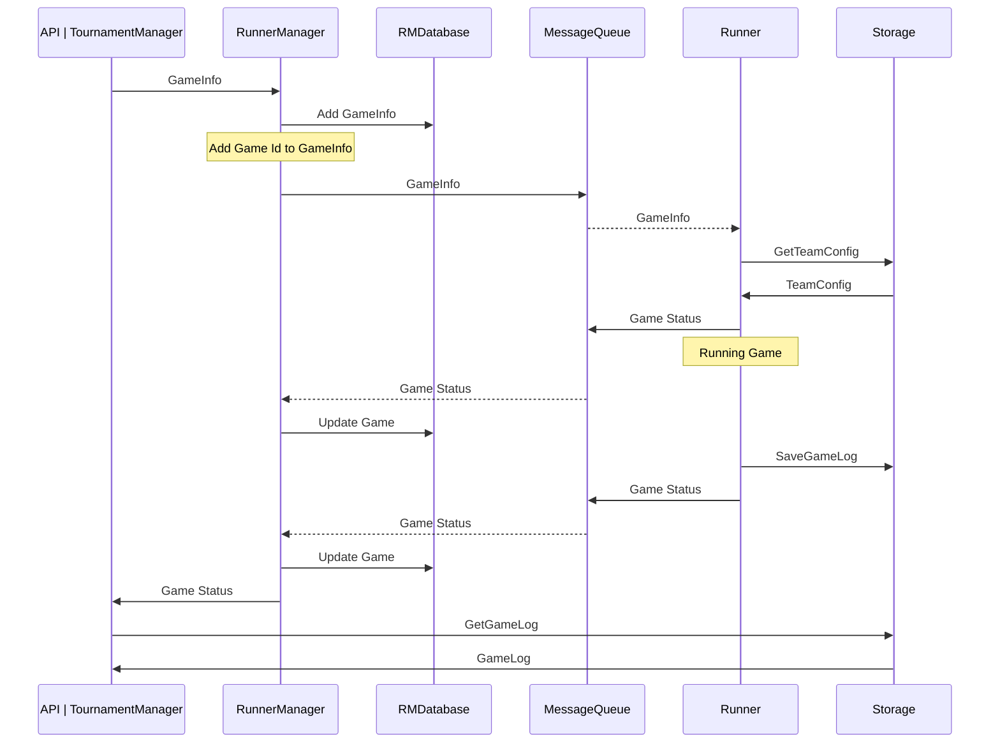
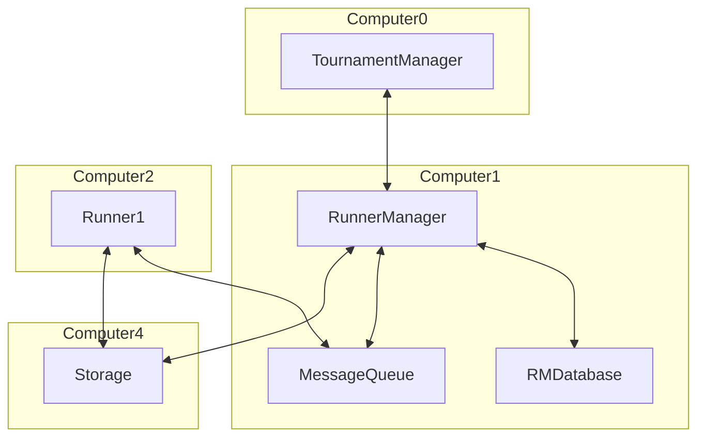
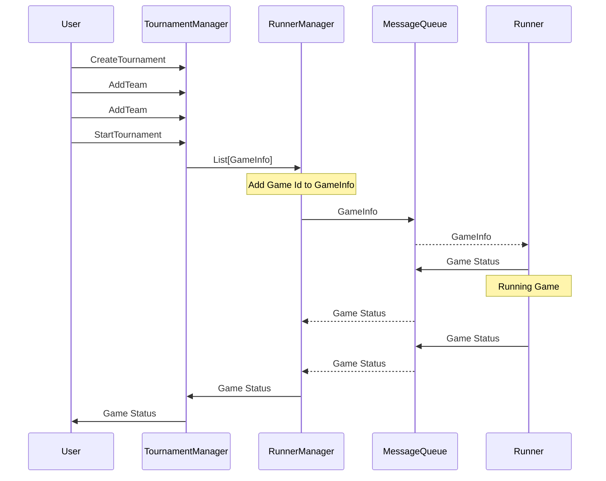

# Foxsy Tournament Manager

## Introduction

Foxsy Tournament Manager is a system that can manage the tournament of Soccer Simulation Game.

## Workflow





- GameInfo: GameId, Left Team Name, Right Team Name, Left Team Config, Right Team Config, Server Config

- Team Config:

```json
{
    "TeamBase": "CYRUS",
    "Config":{
        "Version": "1"
    },
    // or
    "Config":{
        "Formation": "4-4-2",
        "Offensive": "0 - 10",
        "Defensive": "0 - 10",
        "Risk": "0 - 10"
    },
    // or
    "Config":"config id: path to config dir"
}
```

## RunnerManager

RunnerManager is a fastAPI application that can receive GameInfo or list of GameInfo and send the GameInfo to the Runner by using RabitMQ or calling API of the Runner.

RunnerManager is responsible for managing the GameInfo and GameStatus. It will store the GameInfo and GameStatus in the database.

RunnerManager is also responsible to validate the team config and server config.

## Runner

Runner is a fastAPI application or is able to read messages from RabitMQ.
Runner is respopnsible for running the game and sending the game status to the RunnerManager, also saves the game log to the storage.
If the Runner is a fastAPI application, it should call the RunnerManager API to update the game status and register itself to the RunnerManager.

## Tournament Manager



