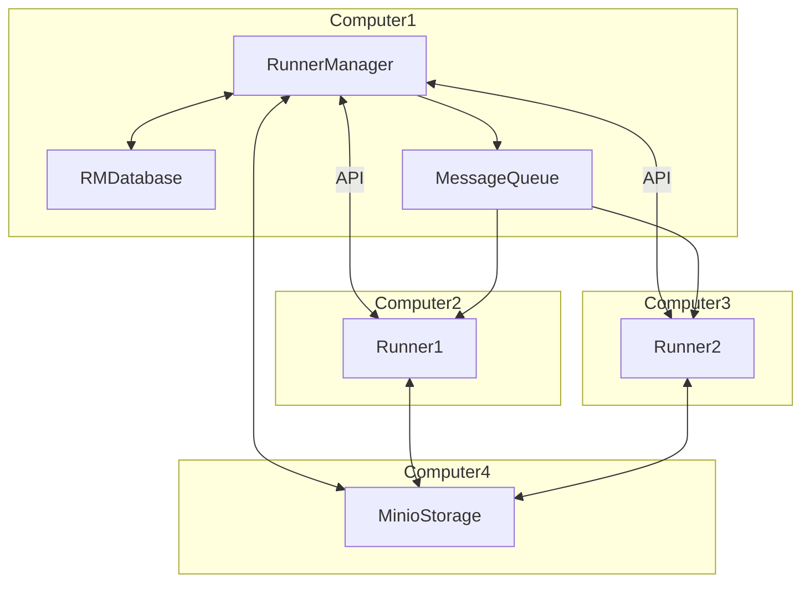
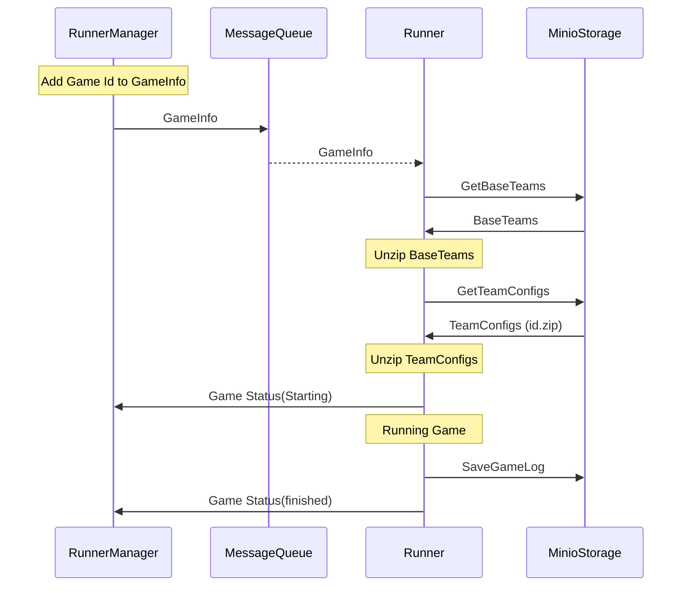
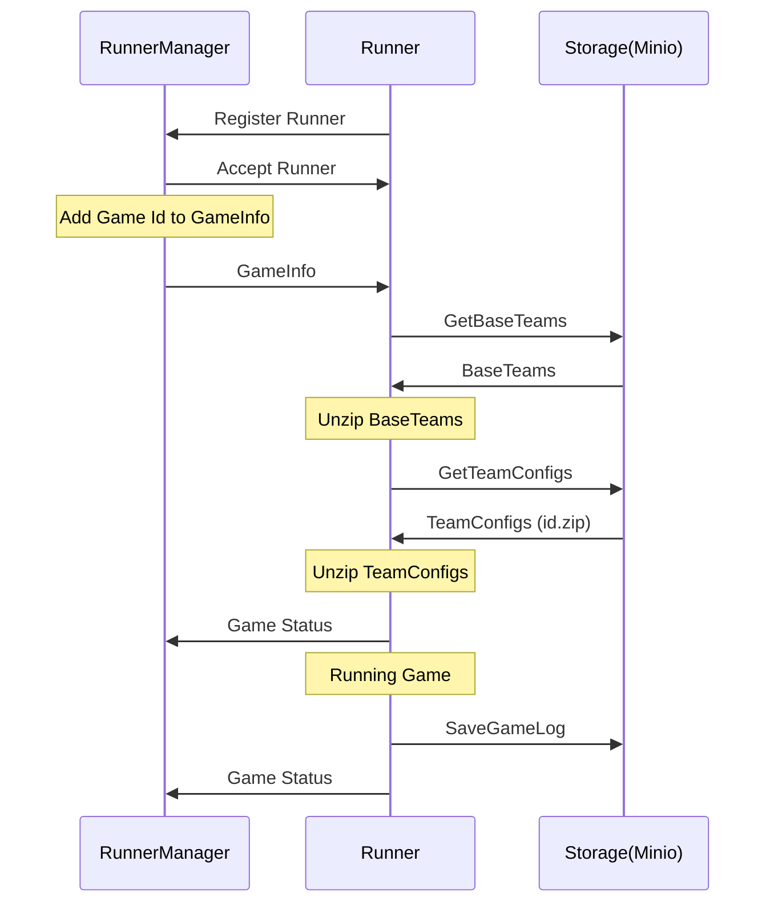

# Foxsy Game Runner

Foxsy game runner is a application that can 
receive soccer simulation 2D game information
and run the game.

This application can receive the game information from api or rabit mq.
The application needs binary of base team, soccer simulation 2D server.

It can automatically get rcssserver binary, base team and configs from
another server by using api.

## Workflow



### Sequence Diagram (RabitMQ)



### Sequence Diagram (API)



## Data Dir Structure

- They can be changed from data_dir.py file.
``` bash
data
├── baseteam
│   ├── base_team_1
│   ├── cyrus
│   ├── oxsy
│   └── ...
├── server
│   └── rcssserver
├── teamconfig
│   ├── 1
│   ├── 2
│   └── ...
└── gamelog
    ├── 1
    ├── 2
    ├── ...
    ├── 1.zip
    ├── 2.zip
    └── ...
```

## Usage by docker file

### build the docker image

```bash
docker build -t app-runner .
```

### create logs directory and data directory

```bash
mkdir logs
mkdir data
```

### run the docker container

```bash
docker run -it --rm --privileged --name runner-container -p 8082:8082 -v ${PWD}/data:/app/data -v ${PWD}/logs:/app/logs -e API_KEY=secret runner-app
```

### Other parameters

You can pass the following parameters to the docker container:

`DATA_DIR` is the directory where the data is stored. The default value is `/app/data`.

`LOG_DIR` is the directory where the logs are stored. The default value is `/app/logs`.

`API_KEY` is the key to access the api. The default value is `api-key`.

`MAX_GAMES_COUNT` is the maximum number of games that can be run at the same time. The default value is `5`.

`USE_FAST_API` is a flag to enable the fast api. The default value is `true`.

`FAST_API_PORT` is the port where the fast api is running. The default value is `8082`.

`USE_RABBITMQ` is a flag to enable the rabbitmq. The default value is `false`.

`RABBITMQ_HOST` is the host where the rabbitmq is running. The default value is `localhost`.

`RABBITMQ_PORT` is the port where the rabbitmq is running. The default value is `5672`.

`RUNNER_MANAGER_IP` is the ip of the runner manager. The default value is `localhost`.

`RUNNER_MANAGER_PORT` is the port of the runner manager. The default value is `5672`.

`MINIO_ENDPOINT` is the endpoint of the minio. The default value is `localhost:9000`.

`MINIO_ACCESS_KEY` is the access key of the minio. The default value is `minioadmin`.

`MINIO_SECRET_KEY` is the secret key of the minio. The default value is `minioadmin`.

`SERVER_BUCKET_NAME` is the server bucket name. The default value is `server`.

`BASE_TEAM_BUCKET_NAME` is the base team bucket name. The default value is `baseteam`.

`TEAM_CONFIG_BUCKET_NAME` is the team config bucket name. The default value is `teamconfig`.

`GAME_LOG_BUCKET_NAME` is the game log bucket name. The default value is `gamelog`.

## Messages

### AddGameMessage

```json
{
  "game_info": {
    "game_id": 3,
    "left_team_name": "team1",
    "right_team_name": "team2",
    "left_base_team_name": "cyrus",
    "right_base_team_name": "cyrus",
    "server_config": "",
    "left_team_config_id": 1,
    "right_team_config_id": 2,
    "left_team_config_json": "{\"version\":1, \"formation_name\":\"433l\"}",
    "right_team_config_json": "{}"
  }
}
```

### AddGameResponse

```json
{
  "game_id": 3,
  "status": "running",
  "success": true,
  "error": "",
  "port": 6003
}
```

### StopGameResponse

```json
{
  "game_id": 3,
  "game_port": 6003,
  "success": true,
  "error": ""
}
```

### GetGamesResponse

```json
{
  "games": [
    {
      "game_id": 1,
      "status": "running",
      "port": 6001
    },
    {
      "game_id": 2,
      "status": "running",
      "port": 6002
    }
  ]
}
```


## Fast API Endpoints

### GET /

Returns a simple hello world message.

- Python Example:

```python
import requests

response = requests.get("http://localhost:8000/")
print(response.json())
```

- Bash Example

```bash
curl -X GET "http://localhost:8000/"
```

### GET /games

Retrieves the list of games. Requires an API key.

- Python Example

```python
import requests

api_key = "your_api_key"
headers = {"Authorization": api_key}

response = requests.get("http://localhost:8000/games", headers=headers)
print(response.json())
```

- Bash Example

```bash
curl -X GET "http://localhost:8000/games" -H "Authorization: your_api_key"
```

### POST /add_game
Adds a new game. Requires an API key.

- Python Example

```python
import requests

api_key = "your_api_key"
headers = {"Authorization": api_key, "Content-Type": "application/json"}

game_info = {
    "game_id": 1,
    "left_team_name": "team1",
    "right_team_name": "team2",
    "left_team_config_id": 1,
    "right_team_config_id": 2,
    "left_base_team_name": "cyrus",
    "right_base_team_name": "oxsy",
    "server_config": ""
}

message = {"type": "add_game", "game_info": game_info}
response = requests.post("http://localhost:8000/add_game", json=message, headers=headers)
print(response.json())
```

- Bash Example

```bash
curl -X POST "http://localhost:8000/add_game" -H "Authorization: your_api_key" -H "Content-Type: application/json" -d '{game_id": 1, "left_team_name": "team1", "right_team_name": "team2", "left_team_config_id": 1, "right_team_config_id": 2, "left_base_team_name": "cyrus", "right_base_team_name": "oxsy", "server_config": "" }'
```

### POST /stop_game_by_game_id/{game_id}
Stops a game by game id. Requires an API key.

- Python Example

```python
import requests

api_key = "your_api_key"
headers = {"Authorization": api_key, "Content-Type": "application/json"}
game_id = 1

response = requests.post("http://localhost:8000/stop_game_by_game_id/{game_id}", headers=headers)
print(response.json())
```

- Bash Example

```bash
curl -X POST "http://localhost:8000/stop_game_by_game_id {game_id}" -H "Authorization: your_api_key" -H "Content-Type: application/json"
```

### POST /stop_game_by_port/{port}
Stops a game by port. Requires an API key.

- Python Example

```python
import requests

api_key = "your_api_key"
headers = {"Authorization": api_key, "Content-Type": "application/json"}
game_port = 1

response = requests.post("http://localhost:8000/stop_game_by_game_port/{game_port}", headers=headers)
print(response.json())
```

- Bash Example

```bash
curl -X POST "http://localhost:8000/stop_game_by_game_port {game_port}  -H "Authorization: your_api key" -H "Content-Type: application/json"
```


